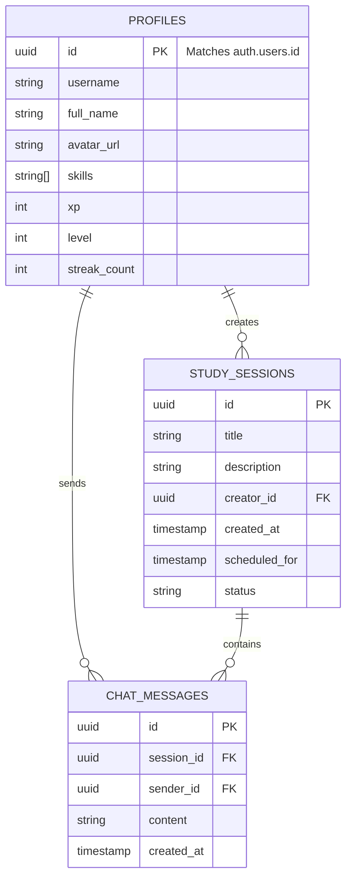

# 🗄️ Database Architecture

The Peer Learning Platform uses **PostgreSQL** hosted on **Supabase**. This document outlines the core tables, their relationships, and the authentication flow.

## 📊 Entity-Relationship Diagram (ERD)

## 🔐 Authentication Flow
1. **User Sign Up/In**: Handled via Supabase Authentication (Email/Password or OAuth).
2. **Profile Generation**: A database trigger automatically creates a row in the `profiles` table matching the newly created user's `auth.users.id`.
3. **Session Management**: Supabase automatically handles JWT token issuance, refresh, and storage in the client.
4. **Row-Level Security (RLS)**: PostgreSQL RLS policies ensure that users can only access and modify their own data, or data in study sessions they are authorized to view.

## 📑 Core Tables

### 1. `profiles`
Stores extended user information and gamification stats.
- `id`: UUID (Primary Key, references `auth.users.id`)
- `username`: Text
- `skills`: Text Array (skills the user wants to learn or teach)
- `xp`: Integer (Experience points earned)
- `level`: Integer (Calculated level based on XP)

### 2. `study_sessions`
Represents collaborative learning rooms.
- `id`: UUID
- `title`: Text
- `creator_id`: UUID (References `profiles.id`)
- `status`: Text (e.g., 'active', 'completed')

### 3. `chat_messages`
Stores all messages sent within study sessions.
- `id`: UUID
- `session_id`: UUID (References `study_sessions.id`)
- `sender_id`: UUID (References `profiles.id`)
- `content`: Text (Limited to 2000 chars)
